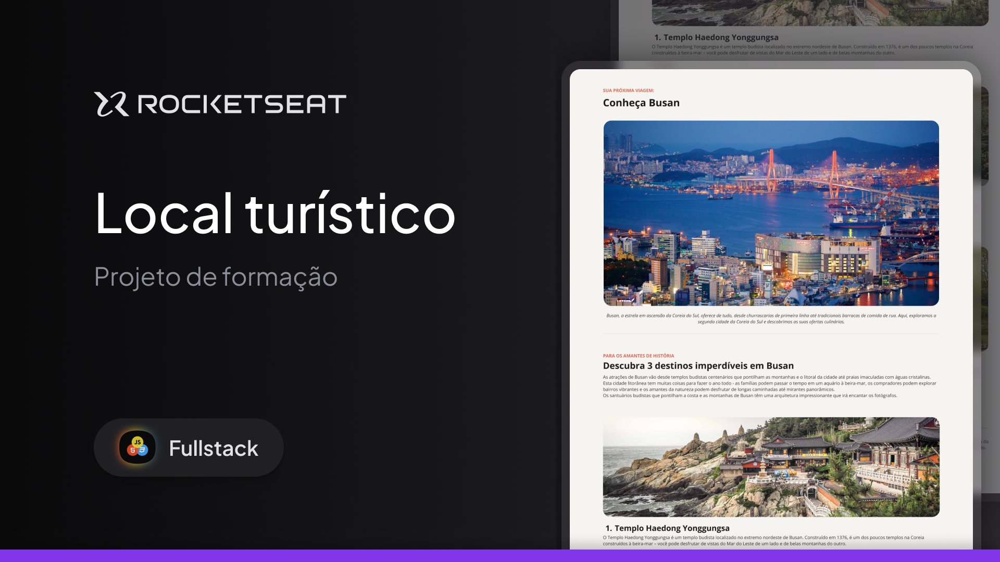

<h1 align="center"> Local Turístico </h1>

Desafio prático para a formação Fullstack, promovido pela Rocketseat para ensino de tecnologias WEB.  
<a href="https://www.rocketseat.com.br/formacao/fullstack" target="_blank">Estude esse projeto em formato de vídeo clicando aqui.</a>

  <a href="#-tecnologias">Tecnologias</a>&nbsp;&nbsp;&nbsp;|&nbsp;&nbsp;&nbsp;
  <a href="#-projeto">Projeto</a>&nbsp;&nbsp;&nbsp;|&nbsp;&nbsp;&nbsp;
  <a href="#-layout">Layout</a>&nbsp;&nbsp;&nbsp;|&nbsp;&nbsp;&nbsp;
  <a href="#memo-licença">Licença</a>

  

 

  

## 🚀 Tecnologias

Esse projeto foi desenvolvido com as seguintes tecnologias:

- HTML e CSS
- Git e Github
- Figma

## 💻 Projeto

Local Turístico é uma página simples que simula um artigo com destinos turísticos populares na Coreia do Sul.

- [Acesse o projeto finalizado, online](https://andreskull2.github.io/local-turistico/)

- [Assistir aulas](https://www.rocketseat.com.br/formacao/fullstack)

## 🔖 Layout

Você pode visualizar o layout do projeto através [DESSE LINK](https://www.figma.com/community/file/1384542229391733447). É necessário ter conta no [Figma](https://figma.com) para acessá-lo.

## :memo: Licença

Esse projeto está sob a licença MIT.

---

Feito com ♥ by Rocketseat :wave: [Participe da nossa comunidade!](https://discord.gg/rocketseat)
